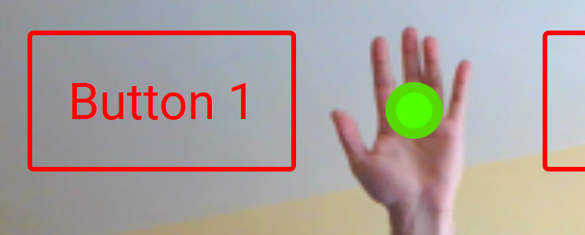

# hand_detect_example

Ejemplo de movimiento de ratón usando la mano para la asignatura IPO 2019

Se puede probar en: https://samuel-m-p.github.io/hand_detect_example/index.html

## Cómo usarlo

Permitir al navegador usar la cámara.

Para que funcione, se debe poner la mano en posicion vertical como en esta imagen:



Cuando se detecta una mano, el puntero (círculo rojo) se vuelve verde.

Si se situa el puntero verde (mano detectada) durante 2 segundos seguidos aproximadamente encima de un elemento que sea "clickable" se ejecuta el "click" en ese elemento.

### Prerequisitos

Una webcam :)

Probado en Firefox 65.0.2 (64-bits) y Chrome 72.0.3626.121 (Build oficial) (64-bits)

### Descarga y ejecucion local

Descargar el proyecto. La forma más sencilla es descargarlo via web (Clone or Download => Download zip)
Descomprimir y abrir el archivo 'index.html' en el navegador.

*Nota: Debido a las restricciones a la hora de cargar el archivo xml del haarcascade, para hacer las pruebas en local he utilizado Firefox. Si usáis otros navegadores (ej. Chrome) obtendréis un error del tipo: Access to XMLHttpRequest at 'file:...' from origin 'null'.*

*Para solucionarlo, debéis ejecutar un servidor de prueba local. Lo más simple: https://developer.mozilla.org/es/docs/Learn/Common_questions/set_up_a_local_testing_server*

## Modificar el proyecto

Para incluir nuevos elementos, basta con añadirlos dentro del div que contiene el canvas de video, al igual que el resto de elementos

```
<div class="canvas-container" id="container"> 
		<a href="javascript:void" id="button1" class="button clickable" onclick='button1_click();'>Button 1</a> 
    ... elemento
    ... elemento
<div>
```

A modo de ejemplo, el proyecto contiene 5 elementos además del canvas donde se muestra el video. 4 de ellos son de tipo 

A step by step series of examples that tell you how to get a development env running

Say what the step will be

```
Give the example
```

And repeat

```
until finished
```

End with an example of getting some data out of the system or using it for a little demo

## Running the tests

Explain how to run the automated tests for this system

### Break down into end to end tests

Explain what these tests test and why

```
Give an example
```

### And coding style tests

Explain what these tests test and why

```
Give an example
```

## Deployment

Add additional notes about how to deploy this on a live system

## Built With

* [Dropwizard](http://www.dropwizard.io/1.0.2/docs/) - The web framework used
* [Maven](https://maven.apache.org/) - Dependency Management
* [ROME](https://rometools.github.io/rome/) - Used to generate RSS Feeds

## Contributing

Please read [CONTRIBUTING.md](https://gist.github.com/PurpleBooth/b24679402957c63ec426) for details on our code of conduct, and the process for submitting pull requests to us.

## Versioning

We use [SemVer](http://semver.org/) for versioning. For the versions available, see the [tags on this repository](https://github.com/your/project/tags). 

## Authors

* **Billie Thompson** - *Initial work* - [PurpleBooth](https://github.com/PurpleBooth)

See also the list of [contributors](https://github.com/your/project/contributors) who participated in this project.

## License

This project is licensed under the MIT License - see the [LICENSE.md](LICENSE.md) file for details

## Acknowledgments

* Hat tip to anyone whose code was used
* Inspiration
* etc
